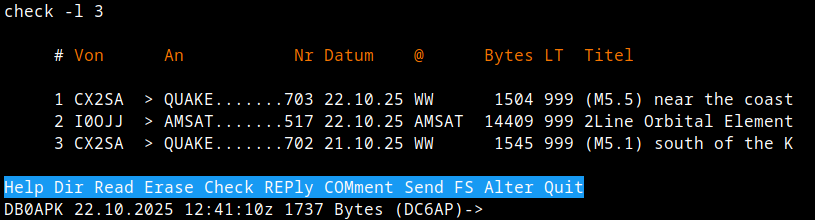
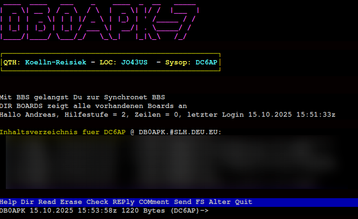
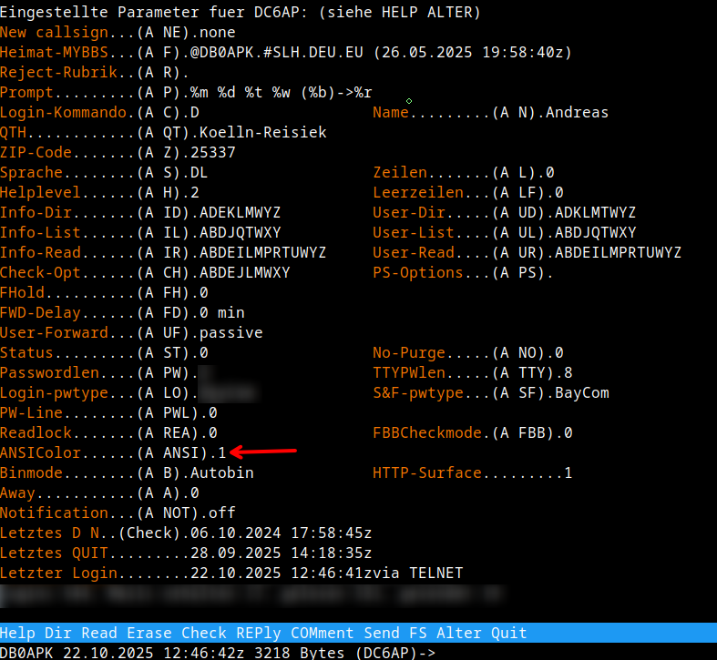

# openBCM

[](https://www.paypal.com/donate/?hosted_button_id=ZDB5ZSNJNK9XQ)

__THIS IS A UNOFFICIAL FORK OF OpenBCM__

OpenBCM - BCM for everybody (packet radio mailbox system initiated by DL8MBT)

The initial commit is equal to the sources available from the maintainer DH8YMB,
http://dnx274.org/baybox/pre/sobcm-1.07b12.tgz

build on 64 bit linux systems:

Version number will be set by `git tags`.

```bash
aptitude install libc6-dev-i386 lib32stdc++-8-dev
make
```

## Important

- With OpenBCM 1.9 I will updated the User DB. Please create a Backup of you current
OpenBCM installation.
- This fork supports only Linux
- I've removed weatherstation supports. Since it's already very old.

## How to use ANSI Color

In the `msg` directory you will find language files like `ctext.<LANGUAGE_CODE>`. 
Copy that file to `ctext.<LANGUAGE_CODE>.ans` and add ANSI Escape
chars for color. Soon, I will add examples under `docs`. 

To enable ANSI color code, the user has to login and enabled it with `a ansicolor 1`.

Very important, most of the PacketRadio Terminal programs does not support ANSI 
Escape chars. But someone has to start. :-) Btw, my PR Terminal Program called 
[FlexPacket](https://github.com/andreaspeters/flexpacket) does support basic ANSI Colors.

## Screenshots




